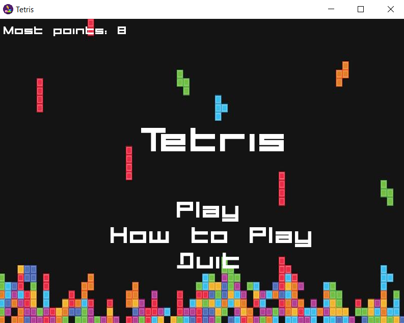

# Gra Tetris

## Jak uruchomić?

### Biblioteka SFML v2.5.1

Biblioteke należy umieścić w Dysku C pod zmienioną nazwą na `SFML`. Jednocześnie należy dodać zmienne środowiskowe do zmienne path.
W swoim przypadku dodałem ścieżki C:\SFML, C:\SFML\lib, C:\SFML\bin, C:\SFML\include.

### MinGW

Wersja MinGW musi odpowiadać wersji SFML. W moim przypadku jest to MinGW Builds 7.3.0 (64-bit). Następnie podobnie jak poprzednio należy dodać pod zmienioną nazwą MinGW do dysku C.
Następnie ponownie musimy dodać zmienne środkowiskowe do path: C:\MinGW\bin

### Kompilacja

#### Wykorzystanie komend z MinGW

Początkowo musimy za pomocą komendy `cd {ścieżka do katalogu z programem}` dostać się do katalogu z grą, dokładnie tam gdzie jest plik main.cpp.
Do skompilowania wykorzystałem kompilator g++. Całość odbyła się za pomocą komendy, dostępnej również w pliku kompilacja.bat:

`g++ -I C:\SFML\include main.cpp functions/constans.h functions/game.h functions\game.cpp functions/textures.h functions/textures.cpp functions/menu.h functions/menu.cpp -mwindows -o main.exe -L C:\SFML\lib -lsfml-graphics -lsfml-window -lsfml-system`

Wystarczy tylko uruchomić plik kompilacja.bat i wszystko samo powinno się skompilować i powinien utworzyć się plik main.exe.

#### CmakeLists.txt

Stworzyłem także dwa `CmakeLists.txt`. Znajdują się one w katalogach `Clion - cmake` oraz `VS - cmake` i aby z nich skorzystać pliki należy umieścić w głównym katalogu z grą (jeśli nie korzysta się z któregoś z nich IDE może wymagać usunięcia jednego z nich), tam gdzie znajduje się plik main.cpp. Jedna z wersji jest dla Clion (wersja dla MinGW), a druga dla Visual Studio.

### Uruchomienie

Aby uruchomić, należy albo z poziomu katalogu dwukrotnie kliknąc na powstały plik main.exe, lub z poziomu konsoli wywołać komendę: 'start main.exe' lub uruchomić w odpowiednim środowisku dzięki plikom CmakeLists.txt.

## Korzystanie z aplikacji

Po uruchomieniu na ekranie startowym mamy 3 przyciski: Play, How to Play oraz Quit.

Jeśli chcemy zagrać klikamy Play i wykorzystując strzałki poruszamy klockami:

- strzałka w lewo - przesuwa klocek w lewo,
- strzałka w prawo - przesuwa klocek w prawo,
- strzałka w dół - przyśpiesza spadanie klocka,
- strzałka w górę - obraca nasz klocek.

Gramy i za każdą linie dostajemy punkt. W momencie końca, po 5 sekundach zamyka się okno z grą i wracamy do Menu.

Jeśli chcemy dowiedzieć się na czym polega gra klikamy How to play, które zawiera krótki opis gry.
Aby zamknąć, należy kliknąc Quit, który kończy działanie aplikacji.

## Wygląd gry

Poniżej zamieszczam zrzuty ekranu z gry, aby lepiej pokazać jak wygląda efekt końcowy.

### Menu

Tak prezentuje się menu. Starałem się, aby było jak najbardziej kolorowe, dlatego wykorzystuje do tego assety. Menu jest klikalne, po najechaniu na przycisk zmienia on kolor.

### Rozgrywka

Rozgrywka również była nastawiona na to, aby jej kolory były bardzo żywe. Cel tego był taki, aby samym wyglądem zachęcić użytkownika do grania.

